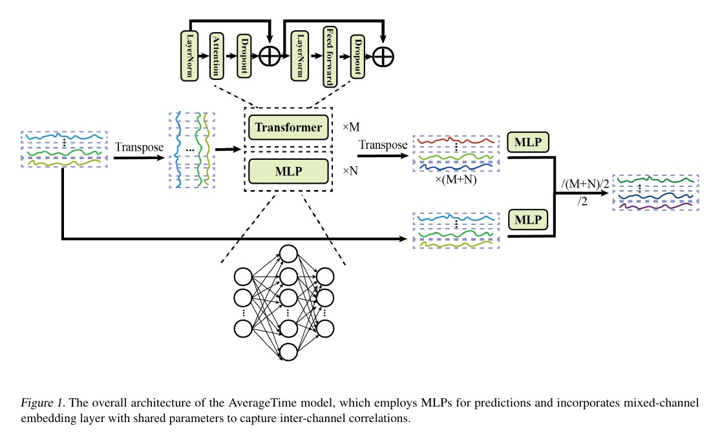

## **AverageTime**  

We have made several modifications to AverageLinear after observing that its performance on the Traffic dataset was suboptimal and that its efficiency did not show significant improvement to iTransformer. To address these issues, we introduced the following changes:  

### **Model Efficiency**  
The most time-consuming part of the model lies in iterating over all channels, with each prediction involving four linear layers. To improve efficiency, we replaced the four-layer prediction structure with MLP layers, significantly enhancing computational efficiency. As a result, our model now achieves efficiency comparable to lightweight linear-based models such as DLinear and CycleNet, while significantly outperforming Transformer-based models like TimeXer and iTransformer. Furthermore, it shows a substantial improvement over the original AverageLinear with four linear layers.  

### **Model Performance**  
We observed that the model's performance was suboptimal on Traffic datasets. To address this issue, we incorporated Transformer encoders into the channel embedding layer, which improved the model's overall performance not only on Traffic datasets but also on other datasets such as ETTh2 and Solar.  

### **LightAverageTime**  
We have incorporated cluster block for the AverageTime to acclecrate the training process, where channel's with high correlection are predicted together, this appoarch has shift the model's training process from channel-wise prediction to group-wise prediction. We have made detail describe in our paper available at https://arxiv.org/abs/2412.20727.

After the incoprating of Transformer encoders, the overall structure is shown as follow:


The updated model now achieves the following performance:  


The results can be reproduced by:
```sh
sh run_main.sh

