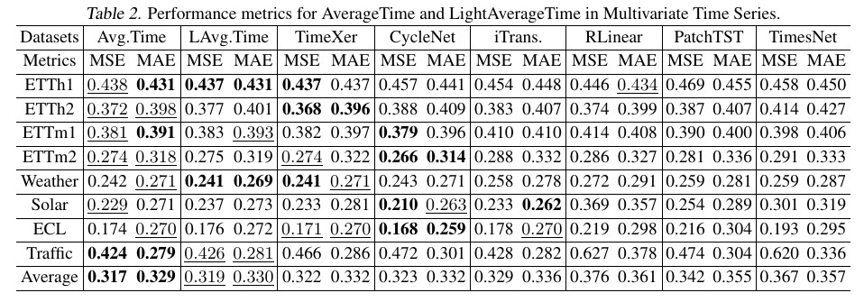

# AverageLinear

This is the official implement of AverageLinear, which use channel embedding with simple averaging and parameter-independent strategy to enhance time series forecasting.

The main code framework is from the official SegRNN code available at:https://github.com/lss-1138/SegRNN. We would like to express our sincere gratitude.

The overall structure is shown as follow:

By enhancing these three changes, we conduct the experiments, the result is shown as follow:

To use the AverageLinear, first:
- create a dataset file and add the corresponding datasets.
- git clone https://github.com/UniqueoneZ/AverageLinear.git.
- cd the AverageLinear file locaion.
- pip install -r requirements.txt
- sh run_main.sh
